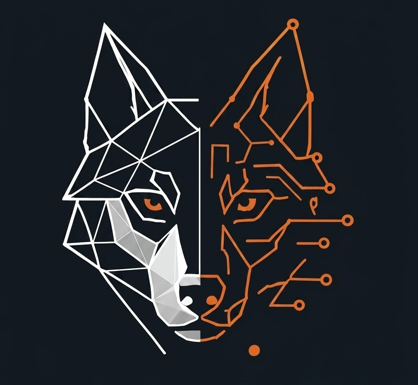
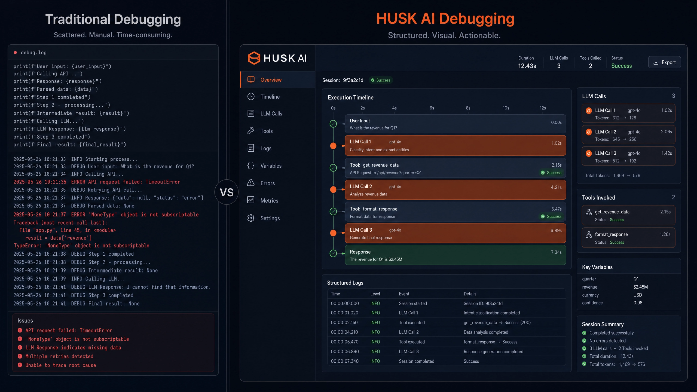

<p align="center">
  
</p>

<h1 align="center">Husk — the visual debugger for AI agents</h1>

<p align="center">
  <strong>Finally, see what your AI is thinking.</strong><br />
  The Chrome DevTools of AI agents — capture every step, rewind any decision, and pause destructive commands before they run.
</p>

<p align="center">
  <a href="LICENSE"></a>
  
  <a href="https://github.com/EdoardoBambini/husk-ai/actions/workflows/ci.yml"></a>
  
</p>

---

Husk runs your AI agents inside (or alongside) a local Studio and shows you — in
real time — what they think, where they fail, and how a change in input changes
their behavior. It captures OpenTelemetry traces from your agents and turns them
into a single, navigable timeline.

**Local-first. No cloud. No telemetry.** The backend runs on your machine and
your agent data never leaves it.

<p align="center">
  
</p>

## Features

- **One timeline for every step.** LLM calls, tool calls, and terminal commands
  from any framework land in a single activity feed with prompts, completions,
  token counts, and cost — instead of a wall of logs.
- **Time-travel / modify-and-replay.** For LangGraph runs, jump into any
  checkpoint, edit the state, and branch a new run from there to see how the
  agent reacts. Stop guessing why it did that — replay it.
- **Pause destructive Cursor commands.** Husk plugs into Cursor's
  pre-tool-execution hooks, so it can stop an agent *before* it runs something
  like `rm -rf` and wait for your Allow / Deny.

## Quick install

For the impatient. Prerequisites: [git](https://git-scm.com/) and
[uv](https://docs.astral.sh/uv/) (uv installs the pinned Python 3.11 for you).

```bash
git clone https://github.com/EdoardoBambini/husk-ai.git && cd husk-ai
uv sync --all-packages
uv run husk-ai start
```

The CLI opens your browser at `http://localhost:7654`. Want demo data to look at
first? Run `uv run husk-ai demo` in another terminal while the server is up.

> A one-line `pip install husk-ai` is on the roadmap. Today, install from source.

Never opened a terminal? The full **Getting started** guide below walks through
everything step by step.

---

## Getting started

> Documentation · 10–15 min the first time

Step-by-step setup — even if you've never opened a terminal. Pick your OS at each
step, copy-paste the commands. By the end you'll have Husk running locally, an
agent you can call your own, and traces streaming live into the Studio.

### Table of contents

**Introduction**
- [Overview](#overview)
- [Requirements](#requirements)

**Quickstart**
- [Open a terminal](#open-a-terminal)
- [Install prerequisites](#install-prerequisites)
- [Run Husk](#run-husk)

**Connect your tools**
- [Connect Cursor](#connect-cursor-optional-but-recommended)
- [Get an agent](#get-an-agent-to-debug)
- [Wire your agent (OTel)](#wire-your-agent-opentelemetry)

**Develop the Studio**
- [Build & dev server](#build-the-studio--run-a-dev-server)

**Reference**
- [Troubleshooting](#troubleshooting)
- [Where files live](#where-files-live)
- [CLI reference](#cli-reference)
- [Glossary](#glossary)

### Overview

Husk is the *Chrome DevTools of AI agents* — a local visual debugger that lives
entirely on your machine. A FastAPI backend boots on port `7654`, a SQLite
database holds your runs at `~/.husk/`, and a React Studio is served from `/`. No
cloud, no signup, no telemetry. Your agent data never leaves your laptop.

By the end of this guide you'll have:

- ✓ The Husk backend running on `http://localhost:7654` with the Studio loaded in your browser.
- ✓ (Optional) Cursor wired so its agent pauses before destructive shell commands — you Allow / Deny in the Studio.
- ✓ Your own agent (or one of the bundled examples) streaming OpenTelemetry traces into Husk in real time.
- ✓ A LangGraph run you can *Modify & replay* — change a value mid-trace, branch the agent from that point.

> **The two parts you'll touch:** the **backend** (Python, started by `uv run husk-ai start`) which exposes the API and serves the Studio, and the **Studio** (the React UI, served from the same backend at `/`). On a fresh clone the backend auto-builds the Studio bundle for you the first time. You rarely need to do anything Studio-related yourself unless you're modifying its source code — see [Develop the Studio](#build-the-studio--run-a-dev-server).

### Requirements

Everything below either comes with your OS, gets installed by the Quickstart
commands, or is brought along by `uv`. You don't install Python yourself.

**Required to run Husk**

- **Python 3.11** — pinned via `.python-version`; uv fetches and uses it automatically. You don't install Python yourself, even if you already have a different version on your system. The code uses `StrEnum` which only exists from 3.11 onward.
- **Node.js 20+** — the backend auto-builds the Studio bundle on first run via `corepack pnpm --filter studio build`, which needs Node. Without it you'll land on a fallback page instead of the real Studio. Also needed for the optional Cursor bridge.
- **uv 0.4+** — Python toolchain (installed in [Install prerequisites](#install-prerequisites)). Bundles Python and manages dependencies.
- **git 2.x+** — to clone the repo. Any version works.
- **An OS terminal** — PowerShell on Windows, Terminal on macOS, any shell on Linux.
- **Internet access** — only for the first `uv sync` (downloads ~700 MB of Python packages). After that Husk runs fully offline.
- **~1 GB free disk space** — for the venv, cache, and Python interpreter.

**Optional · for real-LLM agents & Cursor**

- **Cursor** — the AI code editor. Only needed if you want the Allow / Deny pre-tool intervention bridge. Free download at [cursor.com](https://cursor.com).
- **An LLM API key** — set as an env var (`OPENAI_API_KEY`, `ANTHROPIC_API_KEY`) only if you want your agent to make real LLM calls. Husk itself never makes LLM calls. The bundled examples (Path A) work without a key.

**Supported operating systems**

| OS | Supported version | Notes |
| --- | --- | --- |
| Windows | 10 / 11 | PowerShell 5.1 or 7+. Old "Command Prompt" (cmd.exe) not supported. |
| macOS | 12 Monterey+ | Intel and Apple Silicon both work. |
| Linux | Ubuntu 22.04+ / Fedora 38+ / similar | glibc 2.31+. WSL2 also fine. |

### Open a terminal

A **terminal** is a text window where you type commands instead of clicking
buttons. Don't worry — you're going to copy-paste from this page. No typing
required.

**Windows** — Press the `Windows` key, type `Terminal`, press Enter. You'll see
**PowerShell** — that's what we want. On older Windows 10 you might see "Command
Prompt"; switch to PowerShell instead (Win+X → "Windows PowerShell").

**macOS** — Press `⌘ Command + Space` to open Spotlight. Type `Terminal`, press
Enter. (Alternative: Finder → Applications → Utilities → Terminal.)

**Linux** — Press `Ctrl + Alt + T` — works on most desktop distros (Ubuntu,
Fedora, Mint). Or open your applications menu and search `Terminal`.

### Install prerequisites

You need two things: **git** (downloads Husk's code) and **uv** (a fast Python
toolchain that bundles Python for you, so you don't have to install Python
separately).

#### Install git

**Windows** — Download the installer from
[git-scm.com/download/win](https://git-scm.com/download/win). Run it. Click Next
on every screen (defaults are fine). Close and reopen your terminal so it picks
up `git`.

**macOS** — In your terminal, run:

```bash
xcode-select --install
```

Click **Install** in the popup. If you see *"already installed"*, you're done.

**Linux** — Ubuntu / Debian / Mint:

```bash
sudo apt update && sudo apt install -y git
```

Fedora / RHEL:

```bash
sudo dnf install -y git
```

Verify: type `git --version` + Enter. You should see `git version 2.x.x`.

#### Install uv (Python toolchain)

**Windows (PowerShell)**

```powershell
powershell -ExecutionPolicy ByPass -c "irm https://astral.sh/uv/install.ps1 | iex"
```

**macOS / Linux**

```bash
curl -LsSf https://astral.sh/uv/install.sh | sh
```

> **⚠ Now CLOSE this terminal and OPEN A NEW ONE.**
>
> Windows / Linux / macOS all update PATH only for *new* terminal sessions. Your current PowerShell or shell does **not** see `uv` yet. Skipping this gets you `uv : The term 'uv' is not recognized` or `command not found: uv`.

In the new terminal, verify before continuing:

```bash
uv --version
```

Should print `uv 0.4.x` or higher. If not, see [Troubleshooting](#troubleshooting).

> `uv` reads the `.python-version` file at the repo root and fetches Python 3.11 if it's not already managed by uv. You do **not** need to install Python separately. Any system Python on your machine (3.10, 3.12, 3.13, …) is ignored for this project.

**Common errors on this step**

| Error you see | Fix |
| --- | --- |
| `uv : The term 'uv' is not recognized…` | You ran `uv` in the SAME PowerShell window where you ran the install. Close it completely and open a fresh PowerShell. `uv.exe` lives in `%USERPROFILE%\.local\bin\` — verify with `dir $HOME\.local\bin\uv.exe`. |
| `command not found: uv` (macOS / Linux) | Same cause — new shell needed. Or run `source ~/.bashrc` (bash) / `source ~/.zshrc` (zsh) to reload the current shell's PATH. |
| `git : The term 'git' is not recognized` | Same fix: close and reopen the terminal after the git installer finishes. On Windows the installer adds git to system PATH but already-open shells don't see it. |
| PowerShell: cannot run script (ExecutionPolicy) | Use the install command exactly as written — it includes `-ExecutionPolicy ByPass` which sidesteps the restriction for that one command only. Don't change your system policy. |
| Install ran, file exists, still 'not recognized' | Manually add to the current session: `$env:Path = "$HOME\.local\bin;" + $env:Path`. Then try `uv --version` again. Per-session; new terminals will auto-find it. |

### Run Husk

> **Make sure you're in a fresh terminal** (opened AFTER installing uv). Quick check: `uv --version` should print a version number.

Copy-paste these three commands one at a time (press Enter after each):

```bash
git clone https://github.com/EdoardoBambini/husk-ai.git
```

```bash
cd husk-ai
```

```bash
uv sync --all-packages
```

The third command takes **1–3 minutes the first time** (uv downloads Python 3.11
if you don't already have it, plus ~700 MB of dependencies). When it finishes:

```bash
uv run husk-ai start
```

Your browser opens at `http://localhost:7654`. You see the **Welcome to Husk**
screen. Click **Try free →**. The Dashboard opens — empty, but ready to receive
your first trace.

> **Leave that terminal running.** If you close it, Husk stops.
>
> To stop on purpose: press `Ctrl + C` in the terminal. To start again later: `cd` back into the folder and run `uv run husk-ai start` again. The first boot also auto-builds the Studio bundle (~10–30s) if it isn't built yet.

### Connect Cursor (optional but recommended)

[Cursor](https://cursor.com) is an AI code editor with a built-in agent. It can
read files, run terminal commands, edit code. Husk plugs into Cursor's pre-tool
hooks so that *before* the agent runs a shell command, it pauses and asks you in
Husk Studio: **Allow** or **Deny**.

#### 1a. Install Node.js

> Node.js is a **baseline requirement**, not just a Cursor extra. The backend uses it to auto-build the Studio bundle on first run (`corepack pnpm --filter studio build`). If you skipped this earlier and saw a "Studio isn't built yet" fallback page, install Node here and re-run `uv run husk-ai start`.

**Windows** — Download the LTS installer from [nodejs.org](https://nodejs.org).
Run it. Click Next on every screen. Restart your terminal.

**macOS** — If you have Homebrew:

```bash
brew install node
```

> No Homebrew? Get it at [brew.sh](https://brew.sh) first.

**Linux**

```bash
curl -fsSL https://deb.nodesource.com/setup_20.x | sudo -E bash -
sudo apt install -y nodejs
```

Verify: `node --version` should print `v20.x.x` or higher.

#### 1b. Install the bridge (from source)

> **Heads up:** the `husk-cursor-hook` npm package isn't on the public registry yet — installing with a plain `npm install -g husk-cursor-hook` will fail with `404 Not Found`. The npm-published path is on the roadmap. Until then, install it from your local clone of the Husk repo (same one you cloned in the Quickstart).

Open a **new terminal** (leave the Husk terminal running). From the repo root:

```bash
cd husk-ai
corepack pnpm install
corepack pnpm --filter husk-cursor-hook build
npm install -g ./packages-npm/husk-cursor-hook
```

The `build` step produces `dist/cli.js` (~7 KB, zero runtime deps — uses Node's
native fetch). The global install puts the `husk-cursor-hook` binary on your PATH
so Cursor can spawn it when hook events fire.

Verify the binary resolves:

```bash
husk-cursor-hook --help
```

Should print a usage banner listing `install`, `hook`, and `ping`. If you get
`command not found`, your npm global bin directory isn't on PATH — see the
[Cursor troubleshooting table](#cursor--agent-connection-errors).

#### 1c. Verify the bridge can reach Husk

With `uv run husk-ai start` still running in your *first* terminal:

```bash
husk-cursor-hook ping
```

Expected output: `Husk OK — husk-studio-backend 0.1.0` (exit code 0). If you see
`Cannot reach Husk at http://localhost:7654`, the backend isn't on the default
port. Tell the bridge where it is via the `HUSK_URL` env var:

```bash
HUSK_URL=http://localhost:7656 husk-cursor-hook ping
```

On Windows PowerShell use `$env:HUSK_URL = "http://localhost:7656"` instead.

#### 1d. Wire it into your project

Now `cd` into the **project folder Cursor will open** (the one you want to debug
— NOT the husk-ai repo itself), then:

```bash
husk-cursor-hook install
```

This writes `.cursor/hooks.json` in the current directory. The file maps six
Cursor hook events to the bridge so the agent pauses at the right moments:

- `beforeShellExecution` — pause before any terminal command (the Allow / Deny banner).
- `beforeMCPExecution` — pause before any MCP tool call.
- `beforeReadFile` — pause before the agent reads sensitive files.
- `beforeSubmitPrompt` — fires before each user prompt is sent.
- `afterFileEdit` / `stop` — non-blocking telemetry to render the timeline.

> **Already have a hooks.json?** The install refuses to overwrite — you'll see `refusing to overwrite` on stderr (exit 1). Either delete it first (`rm .cursor/hooks.json`) and re-run, or merge the Husk hooks into your existing file by hand (the template lives at `packages-npm/husk-cursor-hook/src/templates/hooks.json` in the repo).

#### 1e. Test it

Open the project in Cursor (no restart needed — `.cursor/hooks.json` is
auto-reloaded on save). In Cursor's chat, ask: *"Run `ls` and show me what's
here."* When Cursor decides to run the shell command, the Husk Studio in your
browser shows a banner: `Cursor needs you · beforeShellExecution · ls`. Click
**Allow**. Cursor proceeds. ✓

### Get an agent to debug

Husk debugs *agents*. An agent is a program that calls an LLM in a loop — the LLM
picks the next action (run a tool, edit a file, write text), the program runs it,
feeds the result back to the LLM until the task is done. If you don't have one
yet, pick a path below.

#### Path A — Bundled examples (0 min, no API key)

You already have these if you followed the Quickstart — they're in the
`examples/` folder of the husk-ai repo:

```bash
uv run --group examples python examples/langgraph_thread.py
uv run --group examples python examples/otel-autogen.py
```

Open Husk Studio after each run — the trace lands in real time under `/runs`. The
LangGraph one supports Modify & replay so you can see time-travel.

> These bundled examples emit **canned** responses — no real LLM call, no API key needed. They're for verifying Husk's trace pipeline works on your machine. For real LLM calls, use Path B or C.

#### Path B — Clone a starter template (~5 min + API key)

Three popular open-source repos with working agent examples:

- **[langgraph (examples/)](https://github.com/langchain-ai/langgraph/tree/main/examples)** — the LangChain team's own LangGraph examples.
- **[openai-agents-python (examples/)](https://github.com/openai/openai-agents-python/tree/main/examples)** — OpenAI's official Agents SDK examples.
- **[anthropic-cookbook](https://github.com/anthropics/anthropic-cookbook)** — Anthropic's recipes (tool use, code generation, multi-turn).

For each, add one env var when you run their script to send traces to Husk:

```bash
OTEL_EXPORTER_OTLP_ENDPOINT=http://localhost:7654 python their_script.py
```

#### Path C — Vibe-code one with Cursor / Claude Code / Windsurf

If you use an AI coding tool, paste the prompt below and the tool will scaffold a
working agent for you.

```text
Build me a minimal LangGraph agent in a single Python file called my_agent.py.

Requirements:
1. Two nodes: "planner" (writes a 3-step plan from a 'topic') and "answerer"
   (writes the answer from the plan). Use OpenAI's gpt-4o-mini for both.
2. State is a TypedDict with fields: topic, plan, answer.
3. Instrument with OpenTelemetry — install opentelemetry-sdk and
   opentelemetry-exporter-otlp-proto-http. Export via OTLPSpanExporter to
   http://localhost:7654/v1/traces. Resource service.name = "my-first-agent".
4. On each LLM call, set GenAI v1.36 attributes: gen_ai.system="openai",
   gen_ai.request.model, gen_ai.usage.input_tokens, gen_ai.usage.output_tokens.
   Emit "gen_ai.user.message" and "gen_ai.choice" events with the actual
   prompt and completion strings.
5. Use langgraph's SqliteSaver checkpointer at ~/.husk/my_agent.sqlite so
   the run can be replayed in Husk Studio. Set husk.graph_module on the
   root span to "/abs/path/my_agent.py:graph" so replay can find it.
6. Read OPENAI_API_KEY from the environment.
7. When run as __main__, invoke with topic="Rome" and print the final answer.

Only output the file content, no explanation, no markdown fences.
```

After the tool writes the file, install its dependencies:

```bash
pip install langchain langgraph langchain-openai langgraph-checkpoint-sqlite opentelemetry-sdk opentelemetry-exporter-otlp-proto-http
```

Set your OpenAI API key (next subsection), then:

```bash
python my_agent.py
```

The run lands in Husk with the real GPT-4o-mini prompts, completions, tokens, and
cost. Click into it → **Modify and replay** to time-travel.

#### Set your LLM API key

Real LLM calls cost ~$0.001 per agent run on cheap models. Get a key from your
provider, then set it as an env var in the same terminal where you'll run the
agent.

**OpenAI** — get a key at [platform.openai.com/api-keys](https://platform.openai.com/api-keys)

```powershell
# Windows (PowerShell)
$env:OPENAI_API_KEY = "sk-..."
```

```bash
# macOS / Linux
export OPENAI_API_KEY=sk-...
```

**Anthropic** — get a key at [console.anthropic.com/settings/keys](https://console.anthropic.com/settings/keys)

```powershell
# Windows (PowerShell)
$env:ANTHROPIC_API_KEY = "sk-ant-..."
```

```bash
# macOS / Linux
export ANTHROPIC_API_KEY=sk-ant-...
```

> The key lives in **this terminal session** only. Close the terminal and it's gone. To persist: add the `export` line to `~/.bashrc` or `~/.zshrc` (mac/Linux), or use a `.env` file with `python-dotenv`. Never commit the key.

### Wire your agent (OpenTelemetry)

Husk works with any agent that speaks **OpenTelemetry** (OTel) — the standard
observability protocol. Most modern Python agent frameworks support OTel out of
the box or with a one-line config.

**Frameworks Husk understands today**

- **[LangChain](https://python.langchain.com)** — chains LLM calls into apps. Has an OTel integration.
- **[LangGraph](https://langchain-ai.github.io/langgraph/)** — LangChain's stateful graph framework. Supports checkpointers — that's how Husk does time-travel replay specifically on LangGraph runs.
- **[OpenAI Agents SDK](https://github.com/openai/openai-agents-python)** — OpenAI's official Python agent framework.
- **[AutoGen](https://microsoft.github.io/autogen/)** — Microsoft's multi-agent framework.
- **[CrewAI](https://crewai.com)** — multi-agent orchestration.
- **Plain Python + an LLM client** — just emit OTel spans manually — works exactly the same as the frameworks above.

**Generic recipe** — set the OTel endpoint environment variable to point at Husk,
then run your agent normally:

```bash
OTEL_EXPORTER_OTLP_ENDPOINT=http://localhost:7654 python your_agent.py
```

Or wire OTel in code (works for any framework):

```python
from opentelemetry import trace
from opentelemetry.exporter.otlp.proto.http.trace_exporter import OTLPSpanExporter
from opentelemetry.sdk.resources import Resource
from opentelemetry.sdk.trace import TracerProvider
from opentelemetry.sdk.trace.export import BatchSpanProcessor

provider = TracerProvider(resource=Resource.create({"service.name": "my-agent"}))
provider.add_span_processor(
    BatchSpanProcessor(
        OTLPSpanExporter(endpoint="http://localhost:7654/v1/traces")
    )
)
trace.set_tracer_provider(provider)

# now run your agent normally. Husk picks up every span.
```

Each run appears in Husk Studio's Dashboard within ~2 seconds. Click into a run →
see the timeline of every LLM call and tool call, with prompts, completions,
tokens, and cost.

**Bonus — LangGraph time-travel.** Run the bundled LangGraph example (with the
Husk terminal still running, open a new terminal and `cd` into `husk-ai`):

```bash
uv run --group examples python examples/langgraph_thread.py
```

This runs a 2-node graph (*planner → answerer*) about "Rome". Open Husk Studio,
click into the new run, click **Modify and replay**. The Monaco editor opens with
the state JSON. Change `"topic": "Rome"` to `"topic": "Tokyo"`. Click **Run from
here**. A new run appears with the Tokyo answer — Husk re-invokes your graph from
that exact checkpoint, preserving the original.

### Build the Studio & run a dev server

> **Skip this section** if you just want to use Husk. The first time you run `uv run husk-ai start` on a fresh clone, the backend auto-builds the Studio bundle for you. None of the commands below are required.

The Studio is a React + Vite single-page app. Two locations matter:

- `apps/studio/client/` — the source code (React/TS). What you edit if you're contributing.
- `apps/studio/dist/` — the built bundle (HTML/JS/CSS). What the backend actually serves at `/`. Git-ignored.

You'll need **Node.js 20+** (see [1a. Install Node.js](#1a-install-nodejs)).

**Option 1 — Build the bundle once.** For when you've changed UI code and want to
re-bake it into the backend's static dir. Restart `husk-ai start` after.

```bash
corepack pnpm install
corepack pnpm --filter studio build
```

**Option 2 — Live dev server (HMR).** For active editing — instant hot reload.
Vite proxies `/api` back to the backend on `:7654`.

```bash
corepack pnpm dev:studio
```

Then open `http://localhost:5174`. Leave `uv run husk-ai start` running in a
second terminal so the API is alive. Need a different backend port? Set
`VITE_BACKEND_PORT` in `apps/studio/.env.local`.

> **How the auto-build works:** when you run `uv run husk-ai start`, the backend checks for `apps/studio/dist/index.html`. If it's missing and Node is installed, it runs `corepack pnpm --filter studio build` for you (~10–30s the first time, instant thereafter). To disable, set `HUSK_NO_AUTO_BUILD=1`. If Node isn't installed, the backend serves a fallback landing page at `/` with both options above.

### Troubleshooting

If something fails, find your symptom below. Three categories: **setup** (before
Husk starts), **runtime** (backend is up but something's off), and **Cursor /
agent** (your agent or Cursor bridge is misbehaving).

#### Setup errors

| Symptom | Fix |
| --- | --- |
| `uv : The term 'uv' is not recognized…` (PowerShell) | uv was installed in this session but the **current** PowerShell hasn't reloaded its PATH. Close PowerShell completely. Open a fresh window. Verify with `uv --version`. |
| `command not found: uv` (macOS / Linux) | Same — new shell needed. Or `source ~/.bashrc` / `source ~/.zshrc` to reload PATH in the current shell. |
| `git : The term 'git' is not recognized` (PowerShell) | Same root cause — close & reopen the terminal after the git installer finishes. Verify with `git --version`. |
| Install ran, `~/.local/bin/uv.exe` exists, still 'not recognized' | Per-session fix in PowerShell: `$env:Path = "$HOME\.local\bin;" + $env:Path`. Permanent fix: open a new terminal. |
| PowerShell: cannot run script (ExecutionPolicy) | Use the install command **exactly** as written — it includes `-ExecutionPolicy ByPass` which scopes the exception to that single invocation. Don't change your system policy. |
| `uv sync` fails with 'Failed to fetch …' | Network / proxy issue. Behind a corporate proxy: set `HTTPS_PROXY` env var, then retry. |
| `uv sync` succeeds but `uv run husk-ai start` says 'command not found' | Re-run `uv sync --all-packages` from the repo root. The `husk-ai` script is provided by the `husk-cli` workspace package. |
| `ImportError: cannot import name 'StrEnum' from 'enum'` | Your venv was built before the Python 3.11 pin landed. Delete it and resync: `rmdir /s .venv` (PowerShell) or `rm -rf .venv` (mac/Linux), then `uv sync --all-packages`. |

#### Runtime errors

| Symptom | Fix |
| --- | --- |
| Browser shows 'can't connect to localhost:7654' | Backend boot crashed before binding. Check the terminal output. Most common: port 7654 is in use — use `husk-ai start --port 7656` instead. |
| Backend served a fallback 'Studio isn't built yet' page | Studio bundle missing AND auto-build was skipped — most likely Node.js is not installed. Install Node 20+ (see [1a](#1a-install-nodejs)), then restart `uv run husk-ai start`. Or build manually: `corepack pnpm install` then `corepack pnpm --filter studio build` from the repo root, then reload the page. |
| Click 'Try free', page reloads back to Welcome (loop) | The studio dev server is proxying to a different port — check `apps/studio/.env.local` `VITE_BACKEND_PORT`. |

#### Cursor / agent connection errors

| Symptom | Fix |
| --- | --- |
| `husk-cursor-hook: command not found` (or PowerShell: not recognized) | npm's global bin directory isn't on PATH. Find it with `npm config get prefix`, then add `<prefix>/bin` (mac/Linux) or `<prefix>` (Windows) to PATH and reopen the terminal. Also confirm you ran **both** `corepack pnpm --filter husk-cursor-hook build` *and* `npm install -g ./packages-npm/husk-cursor-hook`. |
| `husk-cursor-hook ping: Cannot reach Husk at http://localhost:7654` | Backend isn't running on the default port. Either start it (`uv run husk-ai start`) or point the bridge at it: `export HUSK_URL=http://localhost:7656` (mac/Linux) or `$env:HUSK_URL = "http://localhost:7656"` (PowerShell). The same var must be set in any terminal where Cursor was launched. |
| Cursor doesn't trigger the banner when asked to run a shell command | `.cursor/hooks.json` wasn't installed in your project folder. From your project directory: `husk-cursor-hook install`. Restart Cursor. |
| `AuthenticationError: Incorrect API key` (your agent) | OpenAI / Anthropic key not in your terminal session. Set it: `$env:OPENAI_API_KEY = "sk-..."` (PowerShell) / `export OPENAI_API_KEY=sk-...` (bash). Never commit. |
| `ModuleNotFoundError: No module named 'opentelemetry'` (your agent) | `pip install opentelemetry-sdk opentelemetry-exporter-otlp-proto-http` |
| Run appears in /runs but the timeline is empty | Agent didn't open a root span. Wrap your top-level loop: `with tracer.start_as_current_span("agent.run"):` |
| Run appears but prompts / completions are missing | Agent didn't emit `gen_ai.*` events. Add `span.add_event("gen_ai.user.message", {"content": prompt})` and `span.add_event("gen_ai.choice", {"message.content": completion})` on each LLM span. |
| 'Modify and replay' button is disabled | Root span lacks `husk.graph_module` attribute. Set `root.set_attribute("husk.graph_module", f"{__file__}:graph")`. Only LangGraph runs support replay today. |

### Where files live

Quick map of every directory Husk touches on your machine.

| Asset | Path |
| --- | --- |
| uv binary (Windows) | `%USERPROFILE%\.local\bin\uv.exe` |
| uv binary (mac/Linux) | `~/.local/bin/uv` |
| uv cache of downloaded packages | `%LOCALAPPDATA%\uv\cache\` (Windows) / `~/.cache/uv/` (mac/Linux) |
| Python interpreters uv installs | `%APPDATA%\uv\python\` (Windows) / `~/.local/share/uv/python/` (mac/Linux) |
| Project dependencies for Husk | `<repo>/.venv/` (inside the husk-ai folder) |
| Studio source code (what you edit) | `<repo>/apps/studio/client/` |
| Studio built bundle (what the backend serves) | `<repo>/apps/studio/dist/` |
| Husk runtime data (your runs / traces) | `~/.husk/` (SQLite DB, `auth.json`, `runs/`) |
| `.cursor/hooks.json` (Cursor bridge config) | `<your project root>/.cursor/hooks.json` |

To uninstall everything Husk-related: delete the `husk-ai` repo folder (removes
the `.venv/`) and `~/.husk/`. To uninstall uv: delete `~/.local/bin/uv*` and the
cache folder. Nothing touches your Windows registry or system Python.

### CLI reference

Every command you can run via `uv run husk-ai` in the cloned repo.

| Command | What it does |
| --- | --- |
| `husk-ai start` | Boot the server (default port 7654) and open the Studio in your browser. Auto-builds the Studio bundle on first run if missing. Override port with `--port 7656`; skip the browser open with `--no-open-browser`. |
| `husk-ai demo` | Seed a pending Cursor intervention + one LangGraph run with GenAI v1.36 attrs. Useful for verifying the Studio renders intervention banners and traces correctly before connecting your own agent. |
| `husk-ai list` | List recent runs in the terminal (run id, framework, span count, cost). |
| `husk-ai doctor` | Diagnostics: prints the installed version, your `~/.husk/` home, DB path, and a health check. Run this first when something feels off. |
| `husk-ai clean` | Wipe the local database at `~/.husk/`. Removes all runs, traces, and auth state. Does not delete the cloned repo or your `.venv`. |

The legacy `husk` alias still works inside this workspace so older scripts don't
break.

### Glossary

- **Agent** — A program that calls an LLM in a loop and uses the LLM's output to decide what to do next — call a tool, edit a file, run a shell command, write code.
- **LLM** — Large Language Model — the AI brain (GPT-4o, Claude Sonnet, Gemini, Llama). Takes a text prompt in, returns text out.
- **API key** — A secret string from OpenAI / Anthropic / Google that lets your agent talk to their model. Never commit to git.
- **Prompt** — The text you send to an LLM (system instructions, user question, prior conversation).
- **Tool call** — When the LLM decides "I should call function X with these args" and the agent runs X. Husk renders these as separate spans.
- **Terminal** — A text window where you type commands instead of clicking.
- **git** — Source-control tool. Used here to download Husk's code in one command.
- **uv** — A fast Python toolchain by Astral. Installs Python for you and manages dependencies.
- **Python** — The language Husk is written in. You don't need to write Python to *use* Husk.
- **Node.js** — JavaScript runtime. Needed for the Cursor bridge and the Studio auto-build. Husk's core API runs without it.
- **OpenTelemetry (OTel)** — Industry-standard observability protocol. Any framework that "speaks OTel" streams its internal events as spans.
- **GenAI v1.36** — OTel's spec for AI/LLM apps: standard names for prompts, completions, token counts, etc.
- **OTLP** — OpenTelemetry Protocol — the wire format spans are sent in. Husk accepts OTLP/HTTP on port 7654.
- **Cursor** — AI code editor (a VS Code fork) with a built-in agent. Husk plugs into its pre-tool hooks for Allow/Deny intervention.
- **Span** — One unit of work in OTel — e.g. a single LLM call, a single tool call, a single agent decision.
- **Hook** — A function that fires at a specific moment in another program. Cursor's pre-tool hooks let Husk pause the agent before destructive actions.
- **Checkpointer** — A LangGraph concept: a state-snapshot store. Husk reads it to enable time-travel and replay.
- **Studio** — The React UI served by the backend at `/`. Where you view traces, click into runs, allow/deny interventions, and time-travel.

> Stuck on something not covered? Open an issue on [GitHub](https://github.com/EdoardoBambini/husk-ai/issues).

---

## Repo layout

```
husk/
├── apps/
│   └── studio/                 the product UI (built and served by the backend at /)
├── packages/
│   ├── husk-cli/               the `husk-ai` CLI: start · demo · list · doctor · clean
│   ├── husk-shared/            shared Pydantic schemas + model cost table
│   ├── husk-studio-backend/    FastAPI backend on :7654 — OTel ingest, replay engine, serves the Studio
│   └── husk-sandbox/           sandbox engine — tracer hooks, HTTP virtualization, state capture
├── packages-npm/
│   ├── husk-cursor-hook/       Cursor SDK Hooks bridge (npm CLI)
│   └── husk-vscode-hook/       VS Code / Antigravity extension
└── examples/                   langchain_agent.py · langgraph_thread.py · otel-autogen.py
```

## Development

Prerequisites: `uv`, plus Node.js 20+ and pnpm (via
[corepack](https://nodejs.org/api/corepack.html)) if you work on the Studio UI.

```bash
uv sync --all-packages --group examples   # Python workspace + example deps
corepack pnpm install                      # only for Studio UI work

uv run husk-ai start                       # backend on :7654 (serves the Studio at /)
corepack pnpm dev:studio                   # optional: Studio HMR on :5174 (proxies /api → 7654)
```

Run the checks before opening a PR:

```bash
uv run pytest -q
uv run ruff check .
```

## Contributing

Contributions are welcome — see [CONTRIBUTING.md](CONTRIBUTING.md) for setup,
checks, and commit conventions.

## Security

Please report vulnerabilities privately. See [SECURITY.md](SECURITY.md) — don't
open a public issue for security reports.

## License

Husk is source-available under the **Business Source License 1.1 (BUSL 1.1)** —
see the [LICENSE](LICENSE) file. It converts to an open-source license after the
change date. Husk Cloud is optional, never required.
