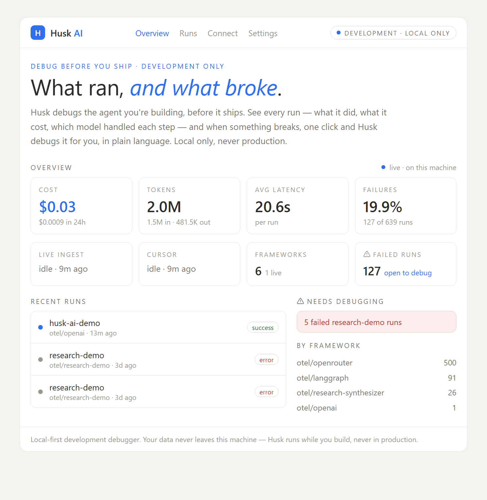

<p align="center">
  
</p>

<h1 align="center">Husk — debug the AI agent you're building</h1>

<p align="center">
  <strong>Your agent does the wrong thing. Husk shows you why, in plain language, and lets you fix it before you ship.</strong><br />
  A local, visual debugger for the agent you're building: what it did, what it cost, which
  model handled each step, and where it went wrong. No traces to read.
</p>

<p align="center">
  <a href="LICENSE"></a>
  
  
</p>

<p align="center">
  
</p>

---

Husk is an interactive debugger you use **while building** an AI agent, before it goes to
production. Connect your agent with one line, run it, and Husk replays every run as a visual
story: what the agent did step by step, which model handled each call and what it cost, and —
when something breaks — **click once and Husk debugs the run for you**: a plain-language
explanation of what went wrong and what to change. Then edit any step and replay from there,
skipping the upstream token cost.

It's built for someone who **uses** AI agents and needs to debug their own, not for an
engineer reading raw traces. The interface speaks in plain language.

**Local-first. Zero data retention.** Everything stays on your machine. The only outbound
call is the automatic debugger's, to a model provider you choose and bring your own key for
(Regolo.ai by default: EU, GDPR, zero retention). Nothing core depends on any one framework.

**Development only — never production.** Husk debugs an agent while you build it, before you
ship. And it can't be used in production by design: trace ingest is loopback-only, so only an
agent running on your own machine can stream in — a production deployment on another host is
refused at the door. Husk is not, and cannot be, production monitoring.

## What you get

- **See what your agent actually did.** Every run as a step-by-step visual, in plain
  language — not a wall of raw trace spans.
- **One click debugs it for you.** When a run fails, click once and Husk reads the whole run
  and tells you the root cause and what to change — automatic debugging in plain language, no
  trace-reading. Flip on auto-debug and it runs the moment a run fails. See
  [docs/ai-layer.md](docs/ai-layer.md).
- **Which model did what.** In a multi-model agent, see which model handled each step and what
  each one cost — the fastest way to find the call that gave the wrong answer. See
  [docs/multi-model.md](docs/multi-model.md).
- **Modify and replay.** Re-run from the broken step with edited state, skipping the upstream
  token cost. See [docs/replay.md](docs/replay.md).

## Quick start

```bash
git clone https://github.com/husk-ai-team/husk-ai.git && cd husk-ai
uv sync --all-packages
uv run husk-ai start        # Studio at http://localhost:7654
uv run husk-ai demo         # seed a sample run to look at
```

Connect your own agent with one line of setup (any framework that speaks OpenTelemetry also
just works):

```python
from husk_shared import instrument_openai
instrument_openai()         # every OpenAI SDK call now streams into Husk
```

That one line is the only code step. Everything after — understanding a run, finding why it
failed, fixing it — happens in the Studio, in plain language. Full setup and frameworks:
[docs/getting-started.md](docs/getting-started.md) and [docs/instrumentation.md](docs/instrumentation.md).

## The numbers

Husk's replay engine resumes a recorded run at the failing step and re-executes only that
step and its successors, deterministically skipping the upstream work. On a committed
500-run benchmark: **mean token bypass 42.1%**, **median 6.9× speed-up**, **100% replay
success**. Reproduce them offline, no API key:

```bash
uv run python benchmark/reproduce.py
```

Methodology: the [benchmark README](benchmark/README.md).

## Documentation

- [Getting started](docs/getting-started.md) · [Instrumentation & frameworks](docs/instrumentation.md)
- [Multi-model debugging](docs/multi-model.md) · [Automatic debugger](docs/ai-layer.md)
- [Modify & replay](docs/replay.md) · [MCP](docs/mcp.md) · [Docker](docs/docker.md)
- [Security & data](docs/security.md) · [Architecture](docs/architecture.md)
- [CLI](docs/cli.md) · [Troubleshooting](docs/troubleshooting.md) · [Glossary](docs/glossary.md)

## Security

Local-first by default, and development-only by design. Trace ingest, the debugger, and replay
are all loopback-only — Husk only ever sees an agent running on this machine, so it can't be
pointed at a production deployment. See [docs/security.md](docs/security.md). Report
vulnerabilities privately per [SECURITY.md](SECURITY.md).

## License

Source-available under the **Business Source License 1.1** ([LICENSE](LICENSE)); converts to an
open-source license after the change date. Contributions welcome ([CONTRIBUTING.md](CONTRIBUTING.md)).
